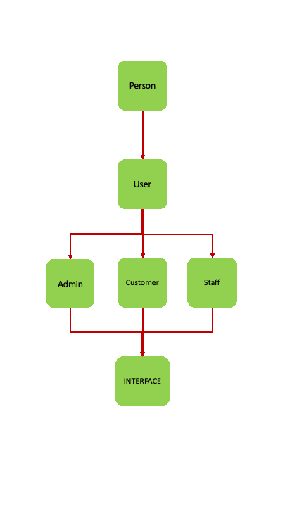

# OOP

**OOP concept:**

 

[object-oriented programming](https://www.educative.io/blog/object-oriented-programming)
Object-Oriented Programming (OOP) is a programming paradigm in computer science that relies on the concept of classes and objects. It is used to structure a software program into simple, reusable pieces of code blueprints (usually called classes), which are used to create individual instances of objects. There are many object-oriented programming languages, including JavaScript, C++, Java, and Python.

OOP languages are not necessarily restricted to the object-oriented programming paradigm. Some languages, such as JavaScript, Python, and PHP, all allow for both procedural and object-oriented programming styles.

A class is an abstract blueprint that creates more specific, concrete objects. Classes often represent broad categories, like Car or Dog that share attributes. These classes define what attributes an instance of this type will have, like color, but not the value of those attributes for a specific object.

Classes can also contain functions called methods that are available only to objects of that type. These functions are defined within the class and perform some action helpful to that specific object type (**_Erin Doherty_**).
<pre>
Benefits of OOP:
- OOP models complex things as reproducible, simple structures.
- Reusable, OOP objects can be used across programs
- Polymorphism allows for class-specific behavior
- Easier to debug, classes often contain all applicable information to them
- Securely protects sensitive information through encapsulation
</pre>
**OOP Example Objective:**
- Using C++ in building a simple oop structure.
- Person class as the parent class of User.  
- User class with 3 child class namely Admin, Customer, Staff.
- After so, we shall make a interface class with the 3 child class.

