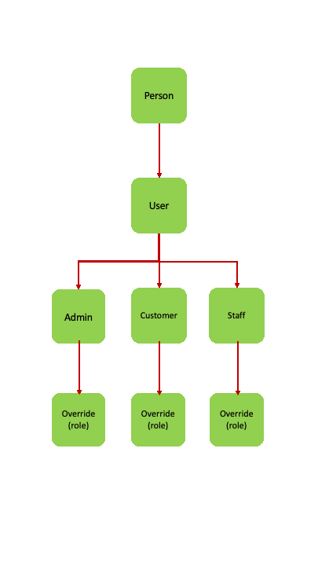

# OOP

**Override Function:**

 

[Override](https://www.educative.io/blog/object-oriented-programming)
As we know, inheritance is a feature of OOP that allows us to create derived classes from a base class. The derived classes inherit features of the base class.

Suppose, the same function is defined in both the derived class and the based class. Now if we call this function using the object of the derived class, the function of the derived class is executed.

This is known as function overriding in C++. The function in derived class overrides the function in base class.
<pre>
Objective:
- Override function 'role' in 3 classes.
- A simple cout on stating each role as prove of concept.
</pre>

